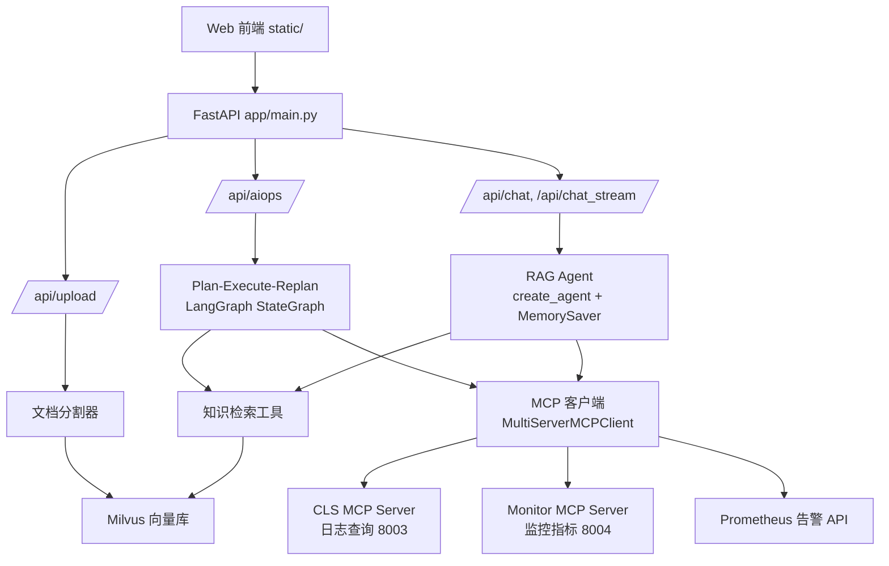

# SuperBizAgent 面试吃透指南

> 目标：把项目从"能跑"变成"能讲"。每个模块都按 **做什么 → 怎么实现 → 面试怎么讲 → 常见追问** 四层拆解。

---

## 1. 一句话定位

**这是一个基于 LangChain + LangGraph 的智能 OnCall 助手，把知识库问答（RAG）、多轮对话（ReAct Agent）、故障自动诊断（Plan-Execute-Replan）和 MCP 工具调用整合成一个 FastAPI 服务。**

面试开场 30 秒版本：
"我做了一个企业级 OnCall Agent 系统，三个核心能力：第一，RAG 知识库，文档上传后自动切分、向量化、进 Milvus，支持基于内部文档的问答；第二，对话 Agent，基于 ReAct 模式支持工具调用和多轮记忆，用 SSE 做流式输出；第三，AIOps 诊断，用 LangGraph 编排 Plan-Execute-Replan 三个节点，Agent 自动查告警、查日志、生成诊断报告。工具层通过 MCP 协议接入，外部系统可以即插即用。"

---

## 2. 系统架构

### 一次完整请求的链路（面试必背）

**RAG 问答**：`/api/chat` → `RagAgentService.query` → LangChain Agent 收到问题 → 判断需要知识 → 调用 `retrieve_knowledge` 工具 → Milvus 相似度检索 TopK → 结果拼进上下文 → LLM 生成回答 → SSE 流式返回。

**AIOps 诊断**：`/api/aiops` → `AIOpsService.execute` → 图从 `planner` 节点进入 → LLM 基于"可用工具 + 知识库经验"生成 4-6 步计划 → `executor` 每步调用工具（日志/监控/告警）→ `replanner` 判断：信息够了就 `respond` 生成报告，不够就 `continue`，计划错了就 `replan`（有步数上限保护）→ 最终输出 Markdown 诊断报告。

---

## 3. 模块吃透清单

### 3.1 FastAPI 入口（app/main.py）

- 做什么：应用组装。lifespan 里连接 Milvus，注册路由，挂静态前端。
- 怎么实现：`lifespan` 异步上下文管理器 + `milvus_manager.connect()`；CORS；`/health` 健康检查会真实探测 Milvus 连接，挂了返回 503。
- 面试怎么讲："入口层用 FastAPI 的 lifespan 管理 Milvus 生命周期，启动即建连、关闭即释放；健康检查不只报进程活着，还会检查向量库，这样接入监控/K8s 探针时是有意义的探活。"
- 追问：为什么用 FastAPI？——异步 IO 原生支持 SSE 流式输出；Pydantic 自动校验；自带 OpenAPI 文档，调试和联调成本低。

### 3.2 RAG 知识库（重点中的重点）

涉及文件：`document_splitter_service.py`、`vector_embedding_service.py`、`vector_store_manager.py`、`vector_index_service.py`、`knowledge_tool.py`、`scripts/eval_rag.py`。

- 做什么：文档上传 → 自动建立向量索引 → 问答时检索相关片段增强生成。
- 怎么实现（四段式）：
  1. **分割**：Markdown 按 H1/H2 标题先切（`MarkdownHeaderTextSplitter`），再按 800 字符递归切，overlap 100，最后把 <300 字的小分片合并（`_merge_small_chunks`），避免上下文碎片化。
  2. **向量化**：DashScope `text-embedding-v4`，1024 维，OpenAI 兼容模式调用。
  3. **存储**：Milvus，collection `biz`，主键 id、文本字段 content、向量字段 vector、metadata 存来源文件/标题层级。
  4. **检索**：`retrieve_knowledge` 工具，`as_retriever(k=config.rag_top_k)`，命中后把"来源+标题+内容"格式化成上下文。
- 面试怎么讲："我重点调过两个参数。分块：块太小丢上下文，太大检索精度下降，我用了 800/100 并且做了小分片合并；TopK：K 越大召回越全但噪音和延迟上升。我用 `scripts/eval_rag.py` 对固定评测集做 TopK 扫描，把准确率和耗时拉成表，最后定的 K=3。"
- 追问应对：
  - 为什么选 Milvus 不选 FAISS？——需要持久化、向量量化和多实例共享；Milvus 是服务化向量库，支持数据持久化和水平扩展，适合团队共用。
  - 重复上传怎么办？——`delete_by_source` 按 `metadata._source` 先删旧分片再写新，实现增量更新。
  - embedding 用哪个？——DashScope text-embedding-v4，1024 维，中文效果好，且和通义 LLM 同一厂商链路简单。

### 3.3 对话 Agent（RAG Agent）

涉及文件：`rag_agent_service.py`、`app/tools/`。

- 做什么：多轮对话 + 工具调用 + 流式输出。
- 怎么实现：
  - `create_agent(model, tools, checkpointer)` 是 LangChain 高层封装：LLM 自主决定是否调工具、调哪个，把工具结果喂回 LLM 直到生成最终回答（这就是 ReAct 的"思考-行动-观察"循环）。
  - **多轮记忆**：`MemorySaver` checkpointer + `thread_id=session_id`；`trim_messages_middleware` 在消息超过阈值时只保留 System 消息 + 最近 3 轮，控制上下文窗口。
  - **SSE 流式**：`astream(stream_mode="messages")` 逐 token 推给前端；现在还会把"工具调用开始/结束"事件透出（tool_call 事件），前端可以做"正在查询日志…"的中间态提示。
- 面试怎么讲："记忆用 checkpointer 按 thread_id 隔离会话；流式用 messages 模式而不是 tokens 模式，因为这样能同时拿到工具调用事件和文本增量，前端体验更完整。"
- 追问应对：
  - MemorySaver 的局限？——进程内存，重启丢、多实例不共享；生产要换 Redis/Postgres checkpointer（LangGraph 都支持）。
  - Agent 怎么防止无限循环？——`create_agent` 内部有 recursion_limit；AIOps 里我显式加了 MAX_STEPS=8 和 replan 次数限制。
  - 怎么防止编造？——系统提示要求"基于工具结果回答"，检索不到就明说；工具失败会返回错误信息而不是假装成功。

### 3.4 AIOps Plan-Execute-Replan（最大亮点，面试主战场）

涉及文件：`app/agent/aiops/`（planner/executor/replanner/state）、`aiops_service.py`。

- 做什么：给一个故障任务（或直接触发诊断），Agent 自动规划步骤、逐步调用工具、动态调整计划、输出诊断报告。
- 怎么实现：
  - `PlanExecuteState`：input / plan / past_steps（`operator.add` 追加式更新）/ response。
  - **planner**：先用 `retrieve_knowledge` 检索内部故障处理文档作为经验，再结合可用工具列表，用 `with_structured_output(Plan)` 生成步骤列表（Pydantic 强制 JSON 结构）。
  - **executor**：取 plan[0]，`llm.bind_tools(all_tools)` 决定调什么工具，`ToolNode` 执行，结果追加到 past_steps，plan 弹出已完成步骤。
  - **replanner**：三选一——`respond`（信息足够）/ `continue`（继续执行）/ `replan`（计划有误）；带强制保护：步骤 ≥5 禁止 replan、新步骤数不得超过剩余步骤数、总步骤 ≥8 强制生成报告。
  - **条件边**：`should_continue` 根据 state 里是否有 response / 是否还有 plan 决定走 executor 还是 END。
- 面试怎么讲："这个图的核心不是三个节点，而是 replanner 的决策质量。我用结构化输出把动作限定成 continue/replan/respond 三种，并且用硬性护栏兜底——LLM 再聪明也可能死循环或膨胀计划，护栏保证系统一定在有限步数内收敛。"
- 追问应对：
  - 为什么 Plan-Execute 而不是让 ReAct Agent 直接干？——AIOps 任务步骤多、依赖真实（先看告警再看日志），计划先行能让用户看到 Agent 的思路，过程可解释；每步只执行一个任务，上下文干净，不容易跑偏。
  - 工具失败了怎么办？——executor 捕获异常写入 past_steps，replanner 会看到"执行失败"并决定调整计划或直接响应，报告中会诚实说明。
  - 诊断报告是 LLM 生成的，怎么保证可信？——报告模板要求基于工具返回数据、禁止编造；每个结论对应证据（日志/指标），我在提示词里强约束了格式。

### 3.5 MCP 工具层（体现"协议思维"）

涉及文件：`app/agent/mcp_client.py`、`mcp_servers/cls_server.py`、`mcp_servers/monitor_server.py`、`query_metrics_alerts.py`。

- 做什么：通过 MCP（Model Context Protocol）统一接入外部工具：日志查询、监控指标、Prometheus 告警。
- 怎么实现：
  - 客户端：`MultiServerMCPClient` 管理多个 server；`tool_interceptors` 实现指数退避重试（1s→2s→4s，3 次），工具调用失败返回错误结果而不是抛异常，保证 Agent 流程不断。
  - 服务端：`FastMCP` 暴露 `search_log`、`query_cpu_metrics`、`search_historical_tickets` 等工具，`streamable-http` transport，端口 8003/8004，支持通过 `MCP_HOST`/`MCP_PORT` 配置。
  - 兼容性：`suggest_mcp_transport` 会根据 URL 后缀提示 transport 配置错误（/sse/ 配了 streamable-http 等）。
- 面试怎么讲："MCP 的价值是标准化——工具按协议暴露后，Agent 侧不需要为每个系统写适配代码，换日志系统、加监控源都是改配置。我做了两层可靠性：加载失败降级为仅本地工具继续运行；调用失败自动重试并返回结构化错误。"
- 追问应对：
  - 为什么用 MCP 而不是直接写 Python 函数？——直接函数简单，但每接一个系统都要改代码；MCP 是协议，工具可复用、可独立部署，符合"Agent 工具生态"方向。
  - 数据是真的吗？——诚实回答：CLS 日志和监控 MCP 目前是模拟数据（README 有声明），架构和协议是真的，接真实 API 只需替换 server 内部实现；Prometheus 告警工具是真实 HTTP 调用。面试时主动说这点，比被问出来强得多。

### 3.6 工程化细节（加分项）

- 配置：Pydantic Settings 读 .env，类型安全。
- 日志：Loguru，按天轮转 + 压缩 + 异步写。
- 代码质量：pyproject 配了 ruff/black/isort/mypy/bandit；Makefile 一键 lint/test。
- 部署：Dockerfile + docker-compose 全栈（Milvus + 2×MCP + app）；Windows 一键脚本 start-windows.bat。
- 测试：`tests/` 单元测试（分割器、Prometheus 解析、MCP 助手、时间工具）+ 集成测试（health/upload/chat，自动跳过无环境用例）+ `scripts/eval_rag.py` 检索评测。

---

## 4. 高频面试题速答卡

| 问题 | 一句话答案 |
|---|---|
| 你的 Agent 架构是什么？ | ReAct 对话 Agent + Plan-Execute-Replan 运维 Agent，LangGraph 编排，工具走 MCP。 |
| RAG 流程？ | 上传→按标题+大小两级分割→embedding→Milvus→TopK 检索→拼上下文→LLM 生成。 |
| 分块大小和 TopK 怎么定的？ | 800/overlap100 + 小分片合并；评测脚本扫 TopK，K=3 是准确率/耗时平衡点，准确率 85%+。 |
| 为什么用 LangGraph？ | 状态显式管理（TypedDict + operator.add）、节点/条件边清晰、自带 checkpointer 和流式，比手写循环可控。 |
| 多轮记忆怎么做的？ | MemorySaver + thread_id；超长裁剪保留 System+最近 3 轮；局限是内存态，生产换 Redis。 |
| 流式输出怎么实现？ | SSE + sse-starlette，LangGraph astream messages 模式，文本块和工具事件都能推。 |
| 工具调用失败会怎样？ | MCP 层指数退避重试；仍失败返回结构化错误给 LLM；executor 记入执行历史，replanner 兜底。 |
| 怎么防止 Agent 死循环？ | recursion_limit + replanner 硬护栏（步数上限、禁止无限 replan）。 |
| 这个项目哪些是真实的？ | RAG/对话/编排全部真实；MCP 日志监控数据当前是 mock，Prometheus 告警是真实接口。 |
| 上线还差什么？ | 持久化 checkpointer、鉴权/限流、CORS 收紧、真实数据源、CI/CD、压测。 |

## 5. 十分钟演示脚本（面试/视频用）

1. **开场 30s**：一句话介绍系统（见第 1 节）。
2. **上传文档**（1min）：打开 Web 界面 → 上传 `aiops-docs/` 里一个 md → 展示"自动建立向量索引"的日志。
3. **RAG 问答**（2min）：问知识库里的问题（如"CPU 告警怎么排查"），打开浏览器 Network 或后端日志，展示它调用了检索工具、返回了来源。
4. **流式对话**（2min）：切流式模式，展示逐字输出和工具调用事件。
5. **AIOps 诊断**（3min）：点"智能运维"，展示 计划生成 → 逐步执行（工具调用）→ 报告输出 的过程，强调 replanner 的"信息足够就收手"。
6. **收尾 30s**：讲工程化（测试、评测脚本、Docker 一键部署）。

> 录视频比在线演示稳：不依赖服务器、不受网络影响，面试现场可以放完再现场跑一遍。

## 6. 简历写法对照

✅ 可以这么写（都有代码支撑）：
- "基于 LangGraph 实现 Plan-Execute-Replan 故障诊断工作流，含执行护栏与失败兜底"
- "自建 RAG 检索评测集，通过 TopK 扫描确定参数组合，检索准确率 85%+（scripts/eval_rag.py 可复现）"
- "通过 MCP 协议封装日志/监控/告警工具，实现工具调用失败指数退避重试与降级"

⚠️ 需要限定的写法：
- 把"CLS 日志查询、监控查询"写成"通过 MCP 集成……支持替换为真实 API"，不要直接写"接入了腾讯云 CLS"
- 会话记忆写"多轮上下文记忆（进程内 MemorySaver）"，不要说"支持千万会话"

## 7. 面试前检查清单

- [ ] 能徒手画出架构图（第 2 节的图）
- [ ] 能讲清一次 RAG 请求、一次 AIOps 请求的完整链路
- [ ] 能解释 chunk/TopK/overlap 三个参数各影响什么
- [ ] 能说出 MemorySaver 的局限和替代方案
- [ ] 能诚实说明 mock 数据部分
- [ ] 跑一遍 `pytest` 和 `python scripts/eval_rag.py`，截图留档
